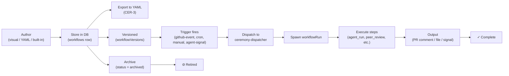

# Ceremony Lifecycle

A ceremony is a reusable, declarative workflow that runs when triggered. This document explains the complete journey from authoring through execution to retirement.

## Overview

A **ceremony** is the binding between:
- **Trigger** — what causes it to run (GitHub event, manual click, cron schedule, or agent signal)
- **Workflow** — the ordered steps that execute (agent runs, approvals, notifications, etc.)
- **Metadata** — name, description, ownership

Ceremonies are declarative: you define the *what* and *when*; the Squadboard engine handles the *how* (scheduling, dispatch, step orchestration, retry, async coordination).

## Formal Specification

Every ceremony conforms to the `apiVersion: squad.io/v1` schema, with a canonical YAML representation. The top-level structure is:

```yaml
apiVersion: squad.io/v1
kind: Ceremony
metadata:
  name: <string>                # required; unique per project
  displayName: <string>          # optional; human-readable label
  description: <string>          # optional; explains purpose
spec:
  trigger: <Trigger>            # required; one of: github-event, manual, cron, agent-signal
  steps:
    - id: <string>              # required; unique within ceremony
      kind: <string>            # required; step type (agent, peer_review, route, etc.)
      [step-specific fields]    # varies by kind
```

**Database representation:** Ceremonies are stored in the `workflows` table as rows with:
- `id` (uuid) — primary key
- `kind = 'ceremony'` — distinguishes from other workflow types
- `triggerKind` + `triggerConfig` — encodes the trigger shape
- `name, slug, description` — metadata
- `status` — 'draft', 'active', 'paused', 'archived'

**Derived fields (not in YAML):**
- `createdAt`, `updatedAt` — timestamps
- `origin` — see [Authoring](#authoring) for derivation rules
- `lastTranslationError` — if auto-generated from prose (Phase 11)

## Authoring

Ceremonies can be authored via three paths:

### 1. Visual Editor (Formulate)

The primary authoring surface. A drag-to-connect flow editor in the Squadboard UI where you:
1. Create a ceremony (name, description).
2. Add a trigger and configure its parameters.
3. Add steps, connect them, configure each step's inputs/outputs.
4. Save the ceremony; it becomes a DB row.

**Capabilities (Phase 16+):**
- Auto-connect on step add (W27 work landed).
- Drag-to-reconnect edges.
- Round-trip to YAML on export.
- Step library with built-in step kinds.

### 2. YAML Editor (Future)

**Status: Coming in W29+**

Users will be able to:
- Export a ceremony as YAML (already shipped in CER-3).
- Edit the YAML file locally or in the code editor.
- Re-import via `POST /ceremonies/import-yaml` (CER-3 endpoint, already shipped).

Today, YAML import/export are available only at the API level.

### 3. Built-in Seeding (CER-2)

**Status: In design (W29)**

New projects are auto-seeded with three built-in ceremonies:
- **design-review** — triggers on PRs touching `design.md`; agent review → peer approval
- **retrospective** — manual trigger; captures meeting notes
- **retro-enforcement** — weekly cron; checks for missing retrospective logs

These are marked with `origin: 'built-in'` (see below).

## Storage and Canonicalization (CER-3)

Ceremonies are stored in two forms: **database rows** and **canonical YAML files**.

### Database Row

The `workflows` table row contains:
- Metadata (name, description, status)
- Trigger config (encoded as `triggerKind` + `triggerConfig` JSONB)
- A reference to the active `workflowVersions` row

### Canonical YAML

The `.workflow.yaml` format is the serialization format for ceremonies. It is:
- **Idempotent:** Exporting a ceremony from the DB and re-importing it produces the same logical ceremony.
- **Versionable:** YAML files can be committed to `.squad/ceremonies/` and imported on project onboarding.
- **Readable:** Humans can read and reason about ceremony structure without the UI.

**Round-trip guarantee (CER-3):** A ceremony exported to `.workflow.yaml` and re-imported via `POST /ceremonies/import-yaml` will produce a ceremony with the same trigger, steps, metadata, and behavior.

### WorkflowVersions Table

Each ceremony has one or more `workflowVersions` rows (immutable snapshots):
- `id` (uuid) — references the `workflows` row
- `yamlContent` — the canonical YAML (stringified)
- `isActive` — boolean; only one version is active at a time
- `createdAt` — when this version was published

This allows versioning: you can publish a new version without breaking in-flight ceremony runs that refer to the old version.

## Versioning

Ceremonies use **semantic versioning on the schema**, not on individual ceremonies.

### apiVersion: squad.io/v1

All ceremonies authored today target `apiVersion: squad.io/v1`. Within v1:
- **Backwards compatible:** New step kinds or trigger types are added without breaking existing ceremonies.
- **No breaking changes:** v1 minor revisions (e.g., v1.0 → v1.1) never remove fields or change semantics.

### Deprecation Policy

When a step kind becomes obsolete:
1. A new step kind is introduced (e.g., `peer_review_v2`).
2. The old kind is marked as "deprecated" in documentation and tooling.
3. Existing ceremonies using the old kind continue to run.
4. At least one major release (v2.0) passes before the old kind is removed.

## Deployment

Ceremonies are "deployed" (become active) via insertion into the `workflows` table. There is no separate "enable" or "publish" step.

### Insertion Flow

1. **Visual Editor:** User creates a ceremony → `INSERT INTO workflows` → ceremony is immediately active (status = 'active').
2. **YAML Import:** User uploads YAML via `POST /ceremonies/import-yaml` → validates against schema → inserts → active.
3. **Built-in Seed:** On project onboarding, built-in ceremonies are inserted (status = 'active', `origin = 'built-in'`).

### Activation

A ceremony is **active** when:
- `status = 'active'` in the DB
- Its trigger condition can fire (e.g., cron scheduler checks it every 5–10s, GitHub webhook dispatcher sees it)

A ceremony is **inactive** when:
- `status = 'draft'` — testing; trigger disabled
- `status = 'paused'` — temporarily disabled; trigger disabled
- `status = 'archived'` — retired; hidden from UI and dispatcher

## Execution

When a ceremony's trigger condition is met, the engine:

1. **Dispatcher** checks the trigger condition:
   - **cron triggers** — `ceremony-scheduler.ts` heartbeat sweep (every 5–10s) checks if `nextFireAt` has passed
   - **github-event triggers** — GitHub webhook dispatcher routes events to `ceremony-dispatcher.ts`
   - **manual triggers** — REST API endpoint `/ceremonies/:id/run` is called
   - **agent-signal triggers** — agents emit signals on lifecycle events; dispatcher listens (limited support today; CER-6 expands this in W29)

2. **Spawn** — A `workflowRun` row is inserted with references to:
   - The ceremony (via `workflowVersionId`)
   - The trigger source (GitHub delivery_id, cron schedule name, etc.)

3. **Execute** — The engine walks the step graph:
   - Execute each `step` in order (or in parallel if the DAG allows)
   - For each step, invoke the appropriate handler (e.g., `agent-run`, `peer-review`, `github-pr`)
   - Collect outputs (agent response, approval decision, PR URL, etc.)
   - Store step results in `stepRuns` table

4. **Emit outputs** — Depending on step configuration:
   - **PR comment** — post result as a GitHub comment
   - **Signal** — emit a signal that other agents can listen on
   - **File** — write result to a file in the repo

## Lifecycle States

Ceremonies transition through states:

```
[draft] → (activate) → [active] ⇄ (pause/unpause) → [paused]
           ↓
           (retire) → [archived]
```

- **draft** — newly created; trigger disabled; use for testing
- **active** — trigger is live; runs when condition fires
- **paused** — trigger disabled; no new runs start; existing runs continue
- **archived** — retired; hidden from UI; no new runs possible

## Retirement (Deletion and Archival)

Today, Squadboard does **not support soft-delete**. Ceremonies are archived:

1. **Archive via UI or API:** `PATCH /ceremonies/:id` with `status = 'archived'`
2. **Effect:** Trigger is disabled; ceremony is hidden from the ceremonies list; no new runs start.
3. **Historical record:** Past runs (`workflowRuns` rows) remain in the DB for audit.
4. **Permanent deletion:** Admins can manually delete the row if needed (not exposed via UI).

**Cascading:** When a ceremony is archived or deleted, associated `ceremonySchedules` rows cascade-delete automatically (DB foreign key constraint).

## Lifecycle Diagram



The diagram shows:
- Three authoring paths converging to storage
- Storage triggers versioning
- Versioning enables idempotent trigger dispatch
- Trigger fire spawns a run
- Run executes steps and produces output
- Separate path for retirement
