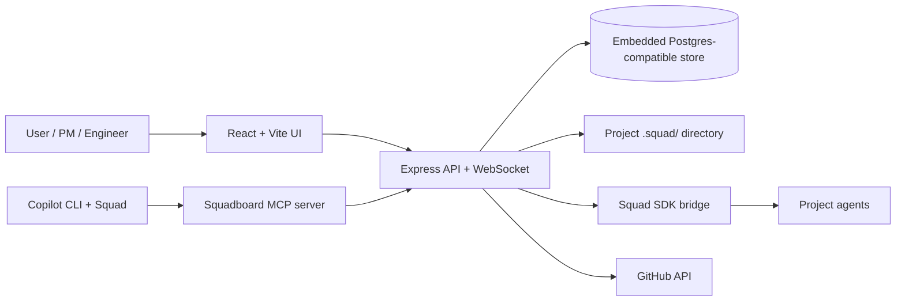
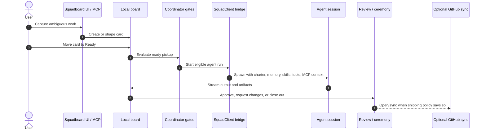
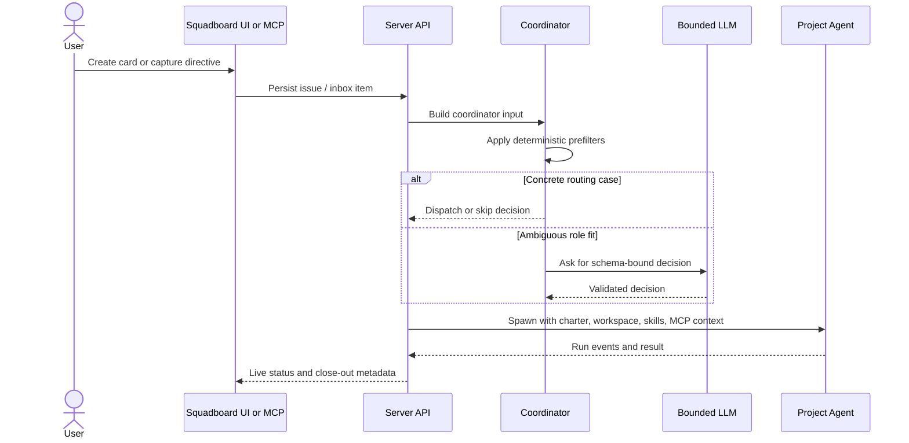
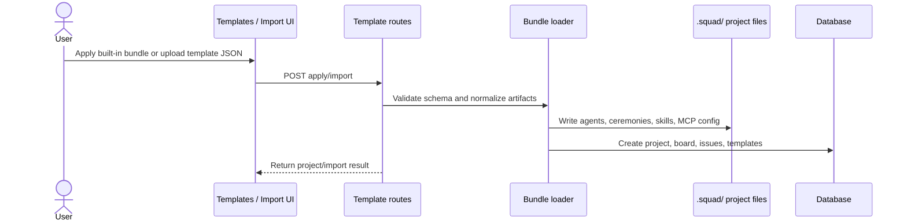

# Architecture

Squadboard is a local-first control plane for multi-agent work. It complements upstream [Squad](https://github.com/bradygaster/squad): Squad remains the Copilot CLI driver and `.squad/` convention source, while Squadboard persists board state, decisions, runs, ceremonies, imports, and audit records.

## Topology

## Compared with upstream Squad architecture

Upstream Squad is chat-first: the coordinator reads a request, spawns agents, agents read `.squad/` memory, Scribe merges decisions, and Ralph watches work. Squadboard keeps those concepts but moves the durable control plane into the server and UI.

| Upstream Squad component | Squadboard counterpart |
| --- | --- |
| Coordinator routing engine | Deterministic prefilters plus bounded LLM coordinator decisions |
| Agents with charters and memory | Project agents imported from or mirrored to `.squad/`, spawned through the server bridge |
| `.squad/` memory | Shared repository files plus PostgreSQL-backed board/run/audit state |
| Scribe | Shared close-out service and directive capture into `.squad/decisions/inbox/` |
| Ralph | Opt-in Ready-column monitor plus GitHub follow-up signals when sync is configured |
| GitHub issue board | Local semantic board first; GitHub sync is optional |

The key difference is timing. Squadboard supports the multi-agent inner loop before GitHub: capture, shape, route, run, review, and approve can all happen locally before a PR or GitHub issue exists.

## Inner-loop sequence

## Coordinator sequence

## Import sequence

## Engine invariants

1. `agent_run` is the LLM execution boundary.
2. The stepper is the sole spawner.
3. Lease and heartbeat are authoritative liveness.
4. Output validation happens after session completion and before recording.
5. Fan-out materializes child workflow state atomically.

## Important services

| Service | Purpose |
| --- | --- |
| `coordinator/input-builder.ts` | Build normalized routing input |
| `coordinator/prefilters.ts` | Deterministic routing gates |
| `services/coordinator-routing-log.ts` | Persist non-dispatch decisions |
| `sdk/spawn-prompt.ts` | Build Copilot CLI + Squad coexistence prompt context |
| `services/directive-capture.ts` | Write decision inbox capture |
| `services/scribe-closeout.ts` | Run close-out and expose metadata |
| `services/ralph-monitor.ts` | Opt-in autonomous work monitor |
| `services/bundle-loader.ts` | Apply bundles, templates, and Squad App-derived project artifacts |
| `services/worktree-lifecycle.ts` | Track and clean safe worktrees |

## Audit invariant

Every automated coordinator action should produce an audit event or decision record with source, source detail, input hash or idempotency key, result, and reason.
