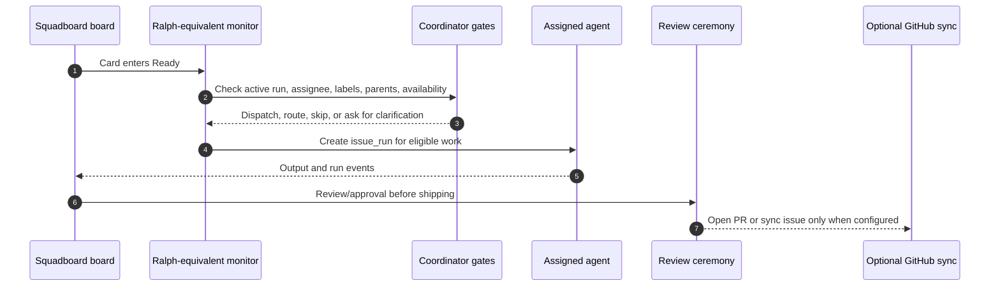

# Scribe and Ralph

## Scribe close-out

Scribe is the background session logger and close-out helper. Daemon, coordinator, and ceremony lifecycle paths converge on the shared Scribe close-out service.

Close-out can record:

- completion summaries
- health/report paths
- directive close-out capture
- branch and worktree lifecycle metadata
- next-wave hints

Close-out is intended to be idempotent: running it again without new work should not create duplicate state.

## Directive capture

Directive capture writes durable markdown into `.squad/decisions/inbox/`. MCP capture is fail-open: the markdown and database path should succeed even when auxiliary MCP capture is unavailable.

## Ralph-equivalent monitor

Ralph is the opt-in autonomous work monitor. In upstream Squad, Ralph watches GitHub issues and PRs. In Squadboard, the Ralph-equivalent loop is **board-first**: it looks at the project board's **Ready** semantic column and only uses GitHub signals when the project has GitHub sync configured.

This is the core Squadboard design decision: the multi-agent inner loop happens before work reaches GitHub. A card can be captured, shaped, assigned, run, reviewed, and approved inside Squadboard. GitHub becomes a sync and shipping surface, not the first place work has to exist.

States:

| State | Meaning |
| --- | --- |
| `active` | Monitor can pick the next eligible action |
| `paused` | Monitor is temporarily disabled |
| `idle` | Monitor ran and found no action |
| `stopped` | Monitor is off |

Priority order:

1. unassigned cards in the Ready column
2. Ready-column cards with an assignee or `squad:{member}` label
3. CI failures
4. review feedback
5. approved and green PRs
6. draft PRs

Every decision, including no-action idle transitions, should be audited.

## Ready work monitor ceremony

Use this ceremony pattern when you want a Ralph-like loop without requiring GitHub:

```text
Ready work monitor
  trigger: schedule, agent signal, or project monitor sweep
  scan: cards where column semantic = ready
  gates: no active run, project autonomy enabled, agent is active, no blocked parent
  action: create an issue_run for assigned work, or record a routing decision for unassigned work
  result: run moves card to In Progress; review/approval moves it toward Done
```

When GitHub is connected, the same monitor can also surface CI failures, review feedback, draft PRs, and approved PRs. Those are follow-up signals; they do not replace the Ready-column pickup path.


