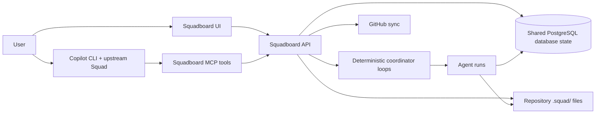
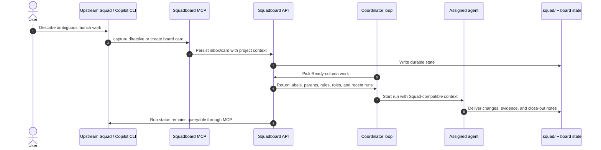

import {FolderRegular, PlugConnectedRegular, ClipboardTaskListLtrRegular} from '@fluentui/react-icons';
import {IconCard, IconGrid} from '../../src/components/FluentDoc';

# Squad integration

Squadboard is designed to complement upstream [Squad](https://github.com/bradygaster/squad), not replace it. Squad provides the Copilot CLI driver conventions and `.squad/` team model; Squadboard provides durable product state, UI, automation, imports, and audit trails.

<IconGrid>
  <IconCard icon={FolderRegular} title=".squad/ stays shared">Charters, decisions, skills, and conventions remain repository-owned.</IconCard>
  <IconCard icon={ClipboardTaskListLtrRegular} title="Board state is durable">Cards and runs are queryable after the chat session ends.</IconCard>
  <IconCard icon={PlugConnectedRegular} title="MCP connects clients">Copilot CLI and VS Code can interact through explicit tools.</IconCard>
</IconGrid>

## Responsibilities

| Layer | Owns |
| --- | --- |
| Squad | Copilot CLI driver behavior, `.squad/` team conventions, agent-oriented prompts, and SKILL.md-style plugin conventions |
| Squadboard | Durable board state, deterministic coordinator decisions, run history, ceremonies, imports, GitHub sync, MCP tools, and UI/audit surfaces |

The integration goal is coexistence: work that the Squad driver can understand should also be representable as durable Squadboard state.

## Architecture

The important split is ownership: upstream Squad keeps the repository-native team conventions and Copilot CLI driver style; Squadboard turns those conventions into durable project state, repeatable loops, and auditable run history.

## Use of Squad SDK integration

Squadboard does use upstream Squad's integration surface when it runs agents. The server bridge builds a Squad-compatible spawn prompt, then creates a session through `@bradygaster/squad-sdk/client`'s `SquadClient`. That means the web board is not pretending to be Copilot CLI; it is a durable operator surface that delegates execution through the Squad client adapter.

| Upstream integration concept | Squadboard implementation |
| --- | --- |
| `SquadClient` connection/session lifecycle | `packages/server/src/sdk/squad-client.ts` |
| Spawn prompt context | `packages/server/src/sdk/spawn-prompt.ts` |
| Run bridge and output capture | `packages/server/src/sdk/bridge.ts` |
| Tool surface for external clients | Squadboard MCP stdio/HTTP server |

## How data moves

1. A user works in Copilot CLI with Squad, VS Code, or another MCP-capable client.
2. The Squadboard MCP server exposes tools such as `capture`, `create_issue`, `run_agent`, and `get_run_status`.
3. Directives from the driver can become Squadboard inbox entries, board cards, or `.squad/decisions/inbox/` decision files.
4. Squadboard can spawn project agents with context compatible with the Squad team conventions.
5. Close-out writes auditable results back to board/run state.

## What stays shared

- `.squad/agents/` charters
- `.squad/decisions/inbox/` team memory
- routing and ceremony conventions
- SKILL.md-style skills
- MCP server recipes

## What is deterministic in Squadboard

Squadboard owns repeatable control flow: dependency gates, availability checks, circuit-breaker decisions, schema validation, routing logs, close-out metadata, and worktree cleanup. LLM calls stay bounded to ambiguity such as semantic role fit and summarization.

## Setup pointers

Use the [MCP integration](./mcp.mdx) guide to connect Copilot CLI or VS Code to Squadboard. Use [Copilot CLI + Squad coexistence](./copilot-squad-coexistence.md) to understand how Squadboard maps driver behavior to durable server state.
